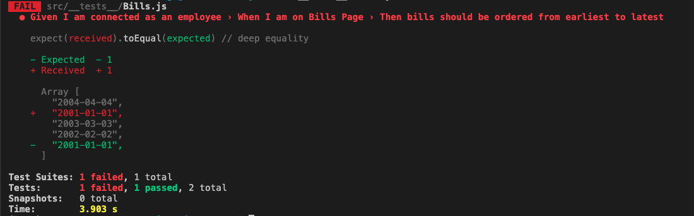
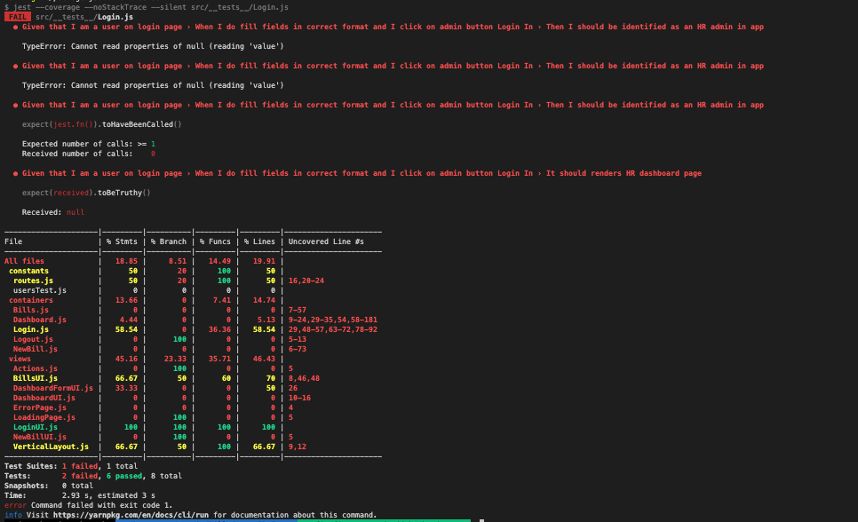

# Liste des bugs

<a name="readme-top"></a>

<p align="right">(<a href="./README.md">back to Bugs list</a>)</p>

### Liste de bugs répertoriés par mes soins

## Mise en place

- 1 Commande de lancement du serveur Backend érronée:

      npm run run:dev

  au lieu de

      npm run dev

- 2

  ```bash
  npm install jest-environment-jsdom
  ```

  dans le fichier `jest.config.js`

```js
const config = {
	testEnvironment: "jest-environment-jsdom",
};
```

- 2.1

```bash
npm audit fix --force
```

- 2.2
  fix available via `npm audit fix --force`

Will install express@2.5.11, which is a breaking change
node_modules/cookie
express >=3.0.0-alpha1
Depends on vulnerable versions of cookie
node_modules/express

4 vulnerabilities (1 moderate, 3 high)

- 2.3
  To address all issues (including breaking changes), run:
  npm audit fix --force

fix available via `npm audit fix --force`
Will install express@2.5.11, which is a breaking change
node_modules/cookie
express >=3.0.0-alpha1
Depends on vulnerable versions of cookie
node_modules/express

2 low severity vulnerabilities

## Backend

<br>

- 1 Connexions

  - 1.1 La connexion Administrateur ne fonctionne pas.

## Frontend

- 1 Note de frais

  - 1.1 Les justificatifs ne sont pas centré dans la modal.
  - 1.2 Les champs TVA ne sont pas clairs.
  - 1.3 Le taux de TVA devrait être une liste avec les différents taux de TVA.
  - 1.4 Certains justificatif n'apparraissent pas.

- 2 Navigation

  - 2.1 L'enveloppe représente une nouvelle note de frais, ce n'est pas le bon icone.
  - 2.2 Il n'y a pas de bouton retoursur les pages

- 3 Code

  - 3.1 Incorrect use of `<label for=FORM_ELEMENT><br>`
    The label's for attribute doesn't match any element id. This might prevent the browser from correctly autofilling the form and accessibility tools from working correctly.

    To fix this issue, make sure the label's for attribute references the correct id of a form field.

<p align="right">(<a href="./README.md">back to Bugs list</a>)</p>
<p align="right">(<a href="#readme-top">back to top</a>)</p>

## Liste des bugs répertorier par Jest <br> + ceux répertoriés dans Notion

Commande pour lancer les tests :

```bash
npm run test
```

<br>
- 1 Le test Bills / les notes de frais s'affichent par ordre décroissant est passé au rouge.

<br>
  

<br>
- 2 Dans le rapport de test "Login, si un administrateur remplit correctement les champs du Login, il devrait naviguer sur la page Dashboard", le test est passé au rouge (cf. copie d'écran).

<br>
 

<br>
<p align="right">(<a href="./README.md">back to Bugs list</a>)</p>
<p align="right">(<a href="#readme-top">back to top</a>)</p>

## 1ère bug

les dates sont dans un format anglo-saxon et mal trié il faut les convertire en format international et les trié dans l'ordre croissant.

### solution:

```js
const rows = (data) => {
	if (data && data.length) {
		data.sort((a, b) => {
			const dateA = new Date(
				a.date.split("-")[0],
				parseInt(a.date.split("-")[1]) - 1,
				a.date.split("-")[2]
			);
			const dateB = new Date(
				b.date.split("-")[0],
				parseInt(b.date.split("-")[1]) - 1,
				b.date.split("-")[2]
			);
			return dateB - dateA;
		});
		return data.map((bill) => row(bill)).join("");
	}
	return "";
};
```

- La fonction rows prend un tableau de factures, les trie par date de manière décroissante, puis les formate en HTML pour l'affichage.

## 2ème bug

● Given that I am a user on login page › When I do fill fields in correct format and I click on admin button Login In › Then I should be identified as an HR admin in app

    TypeError: Cannot read properties of null (reading 'value')

```js
      42 |     const user = {
      43 |       type: "Admin",
    > 44 |       email: e.target.querySelector(`input[data-testid="employee-email-input"]`).value,
         |              ^
      45 |       password: e.target.querySelector(`input[data-testid="employee-password-input"]`).value,
      46 |       status: "connected"
      47 |     }
```

L'erreur vient de `employee-email-input` et `employee-password-input` au lieu de `admmin-email-input` et `admmin-password-input`

### solution:

```js
const user = {
	type: "Admin",
	email: e.target.querySelector(`input[data-testid="admin-email-input"]`).value,
	password: e.target.querySelector(`input[data-testid="admin-password-input"]`)
		.value,
	status: "connected",
};
```

- Remplacement de `employee-email-input` et `employee-password-input` par `admmin-email-input` et `admmin-password-input`

## 3ème bug

Je suis connecté en tant qu'employé, je saisis une note de frais avec un justificatif qui a une extension différente de jpg, jpeg ou png, j'envoie. J'arrive sur la page Bills, je clique sur l'icône "voir" pour consulter le justificatif : la modale s'ouvre, mais il n'y a pas d'image.

Si je me connecte à présent en tant qu'Admin, et que je clique sur le ticket correspondant, le nom du fichier affiché est null. De même, lorsque je clique sur l'icône "voir" pour consulter le justificatif : la modale s'ouvre, mais il n'y a pas d'image.

### solution:

```js
// Vérification de l'extension du fichier
const allowedExtensions = ["jpg", "jpeg", "png"];
const fileExtension = fileName.split(".").pop();

if (!allowedExtensions.includes(fileExtension.toLowerCase())) {
	alert("Seuls les fichiers JPG, JPEG et PNG sont autorisés.");
	this.document.querySelector(`input[data-testid="file"]`).value = ""; // Réinitialise l'input file
	return;
}
```

- On ajoute une vérification de l'extension du fichier et on affiche une alerte si le fichier sélectionné n'est pas au bon format. Le champ de fichier est également réinitialisé dans ce cas.

## 4ème bug

Je suis connecté en tant qu'administrateur RH, je déplie une liste de tickets (par exemple : statut "validé"), je sélectionne un ticket, puis je déplie une seconde liste (par exemple : statut "refusé"), je ne peux plus sélectionner un ticket de la première liste.

Comportement attendu : pourvoir déplier plusieurs listes, et consulter les tickets de chacune des deux listes.

### solution:

bills.forEach((bill) => {
$(`#open-bill${bill.id}`).off();
			$(`#open-bill${bill.id}`).click((e) =>
this.handleEditTicket(e, bill, bills)
);
});

- dans le `constructor`

```js
this.activeLists = {};
```

- dans `handleEditTicket`

```js
if (this.activeBillId !== bill.id) {
	this.activeBillId = bill.id;
	$(".dashboard-right-container div").html(DashboardFormUI(bill));
	$(".vertical-navbar").css({ height: "150vh" });
} else {
	this.activeBillId = null;
	$(".dashboard-right-container div").html(
		`<div id="big-billed-icon" data-testid="big-billed-icon">${BigBilledIcon}</div>`
	);
	$(".vertical-navbar").css({ height: "120vh" });
}
```

- dans `handleShowTicket`

```js
const isListOpen = this.activeLists[index] || false;

// Si la liste est fermée, on l'ouvre
if (!isListOpen) {
	$(`#arrow-icon${index}`).css({ transform: "rotate(0deg)" });
	const filteredTickets = filteredBills(bills, getStatus(index));
	$(`#status-bills-container${index}`).html(cards(filteredTickets));
	this.activeLists[index] = true;
}
// Si la liste est ouverte, on la ferme
else {
	$(`#arrow-icon${index}`).css({ transform: "rotate(90deg)" });
	$(`#status-bills-container${index}`).html(""); //on vide la liste
	this.activeLists[index] = false;
}

// Ajoute des événements clic sur les factures affichées uniquement si la liste est ouverte
if (this.activeLists[index]) {
	bills.forEach((bill) => {
		$(`#open-bill${bill.id}`).click((e) =>
			this.handleEditTicket(e, bill, bills)
		);
	});
}
```

- Listes indépendantes : j'ai remplacé l' approche this.counter et this.index par this.activeLists pour suivre quelles listes sont ouvertes ou fermées individuellement.

- Listes multiples : Chaque liste peut désormais être ouverte ou fermée indépendamment, sans affecter les autres.
  <br>

## Tests unitaires et d'intégration

Le rapport de couverture de branche de Jest indique que les fichiers suivants ne sont pas couverts (cf. copie d'écran) :

- [x] composant `views/Bills` : Le taux de couverture est à 100% néanmoins si tu regardes le premier test il manque la mention “expect”. Ajoute cette mention pour que le test vérifie bien ce que l’on attend de lui.

  ### Solution:

  L'ajout de l'instruction :<br>
  `expect(windowIcon.classList.contains('active-icon')).toBe(true)` <br>
  permet de confirmer que l'icône est correctement mise en valeur, ce qui garantit que l'interface utilisateur fonctionne comme prévu.

- [x] ~~composant views/NewBill~~
- [ ] composant container/Bills :

  - [ ] couvrir un maximum de "statements" c'est simple, il faut qu’après avoir ajouté tes tests unitaires et d’intégration <a href='http://127.0.0.1:8080/coverage/lcov-report/containers/Bills.js.html'> le rapport de couverture du fichier `container/Bills`</a> soit vert. Cela devrait permettre d'obtenir un taux de couverture aux alentours de 80% dans la colonne "statements".

  - [ ] ajouter un test d'intégration `GET` Bills. Tu peux t'inspirer de celui qui est fait (signalé en commentaires) pour Dashboard.

- [ ] composant `container/NewBill` :

  - [ ] couvrir un maximum de "statements" : c'est simple, il faut que le rapport de couverture du fichier `container/NewBill` soit vert (accessible à <a href='http://127.0.0.1:8080/coverage/lcov-report/containers/NewBill.js.html'> cette adresse</a> quand tu auras lancé le serveur). Cela devrait permettre d'obtenir un taux de couverture aux alentours de 80% dans la colonne "statements".

  - [ ] ajouter un test d'intégration `POST` new bill.

- [x] ~~composant views/VerticalLayout~~

Respecter la structure des tests unitaires en place : Given / When / Then avec le résultat attendu.
Un exemple est donné dans le squelette du test `__tests__/Bills.js`
